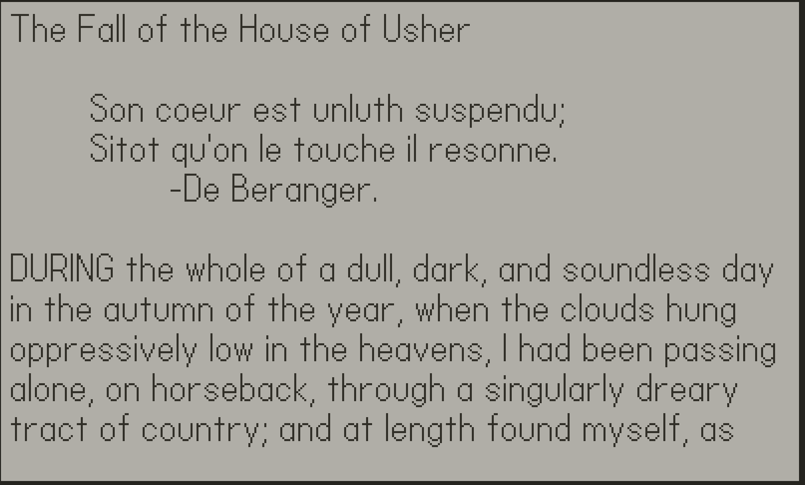

# Readme

## Description
PocketPoe is a program for the [playdate console](https://play.date) that lets you read an assortment of short stories by author Edger Allen Poe.

## Features & Controls
- While in the library view, toggle rain sounds by pressing 'B'.
- 'Left' and 'Right' on d-pad to select browse books in the library.
- press 'A' to view a book
- 'Up' and 'Down' to move lines in the book view.
- The 'Crank' can also be used to scroll through a book. 
- Pressing 'B' will exit book view and return you to the library. 
- Progress is saved while reading a story.

## Running PocketPoe
> rm -rf pocket Pocket\ Poe.pdx/ ; pdc source "Pocket Poe"; open Pocket\ Poe.pdx/ ; cp -r Pocket\ Poe.pdx/ ../../Disk/Games/

## Playing PocketPoe on your playdate
This repo contains a PocketPoe.pdx that can be added to your playdate [here](https://play.date/account/sideload/). 
I don't have a playdate yet, so PocketPoe may behave differently on actual hardware. If it does, please let me know.

## Contributing
On the off chance you want to contribute in anyway (feedback, feature requests, bugs etc) feel free to submit merge requests, comments or msg me on github. Thanks for reading.
 
